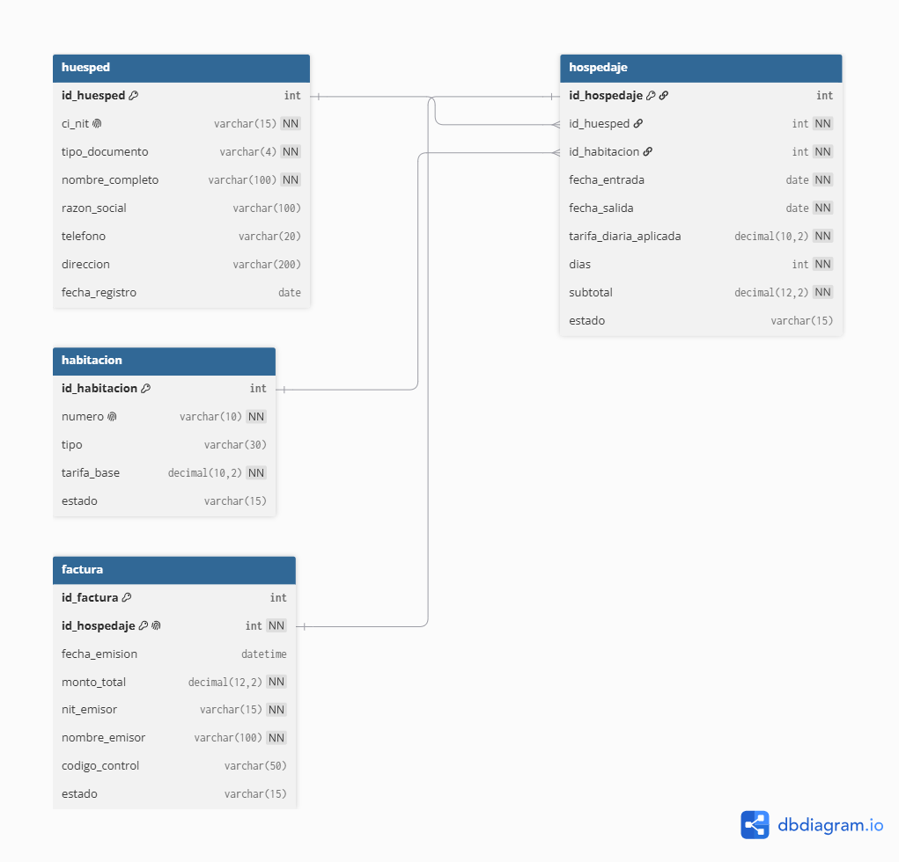

---

## Diseño de Interfaz

Los diseños, diagramas de navegación y prototipos del sistema se encuentran en la carpeta **/docs/design/**:

- 📐 [Diagrama de Navegación — Imagen](docs/design/diagrama_navegacion_hotell.png)
- 📐 [Diagrama de Navegación — Archivo Fuente](docs/design/diagrama_navegacionhotel.drawio)
- 📝 [Formulario de Registro](docs/design/Registro.png)
- 📋 [Listado de Facturas](docs/design/Listado.png)
- 📊 [Reporte de Ingresos](docs/design/Reporte.png)

## Diseño Detallado — Diagramas UML (PlantUML)

Los diagramas de Casos de Uso, Secuencia, Estados y Clases del Sprint 1 se encuentran en la carpeta **/docs/uml/**:

### HU-01: Registrar datos del huésped
- 📐 [Casos de Uso](docs/uml/HU01_casos.png) · [Código](docs/uml/HU01_casos.puml.txt)
- 📐 [Diagrama de Secuencia](docs/uml/HU01_secuencia.png) · [Código](docs/uml/HU01_secuencia.puml.txt)
- 📐 [Diagrama de Estados](docs/uml/HU01_estados.png) · [Código](docs/uml/HU01_estados.puml.txt)
- 📐 [Diagrama de Clases](docs/uml/HU01_clases.png) · [Código](docs/uml/HU01_clases.puml.txt)

### HU-02: Validar CI / NIT
- 📐 [Casos de Uso](docs/uml/HU02_casos.png) · [Código](docs/uml/HU02_casos.puml.txt)
- 📐 [Diagrama de Secuencia](docs/uml/HU02_secuencia.png) · [Código](docs/uml/HU02_secuencia.puml.txt)
- 📐 [Diagrama de Estados](docs/uml/HU02_estados.png) · [Código](docs/uml/HU02_estados.puml.txt)
- 📐 [Diagrama de Clases](docs/uml/HU02_clases.png) · [Código](docs/uml/HU02_clases.puml.txt)

### HU-03: Registrar habitación y fechas
- 📐 [Casos de Uso](docs/uml/HU03_casos.png) · [Código](docs/uml/HU03_casos.puml.txt)
- 📐 [Diagrama de Secuencia](docs/uml/HU03_secuencia.png) · [Código](docs/uml/HU03_secuencia.puml.txt)
- 📐 [Diagrama de Estados](docs/uml/HU03_estados.png) · [Código](docs/uml/HU03_estados.puml.txt)
- 📐 [Diagrama de Clases](docs/uml/HU03_clases.png) · [Código](docs/uml/HU03_clases.puml.txt)

##  Diseño de Arquitectura de Datos

El modelo de datos cumple con la Tercera Forma Normal (3FN) y garantiza integridad referencial mediante claves primarias y foráneas.

### Modelo Relacional

###  Archivos del modelo
- 📐 [Diagrama de Base de Datos — Imagen](docs/database/modelo_relacional.png)
- 📐 [Diagrama — Archivo Fuente](docs/database/modelo_relacional.dbml.txt)
- 📝 [Esquema SQL de Creación](docs/database/esquema.sql)

